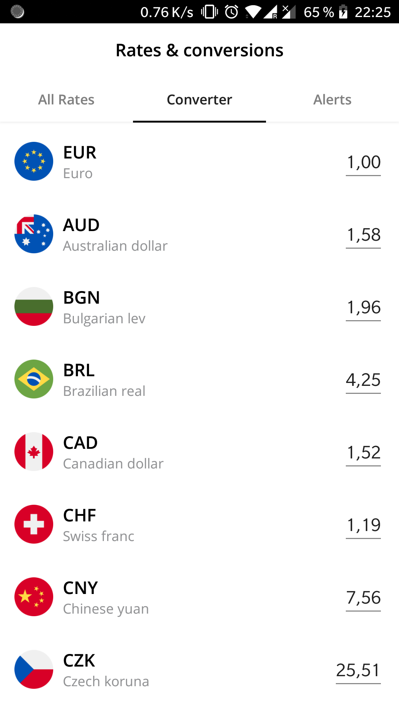

Konvert is a sample Android application written in Kotlin. It mimics the [Revolut](https://www.revolut.com/) currency converter.

# Screenshots

  
  

# Technologies used

This project is developped in Kotlin, and uses [the CLEAN architecture.](https://8thlight.com/blog/uncle-bob/2012/08/13/the-clean-architecture.html)

# Main libraries used

* Dagger2
* RxJava2
* Retrofit2

# Modules

* `data/` : contains the code to access to the data (repository pattern)
* `domain/` : contains the business logic and the usecases
* `app` : Presentation layer, contains the UI 
